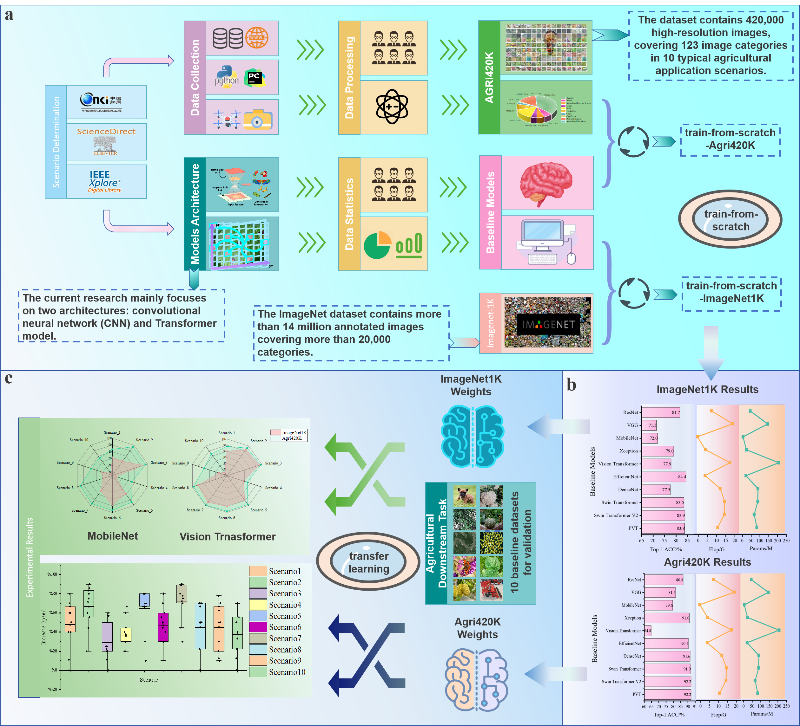
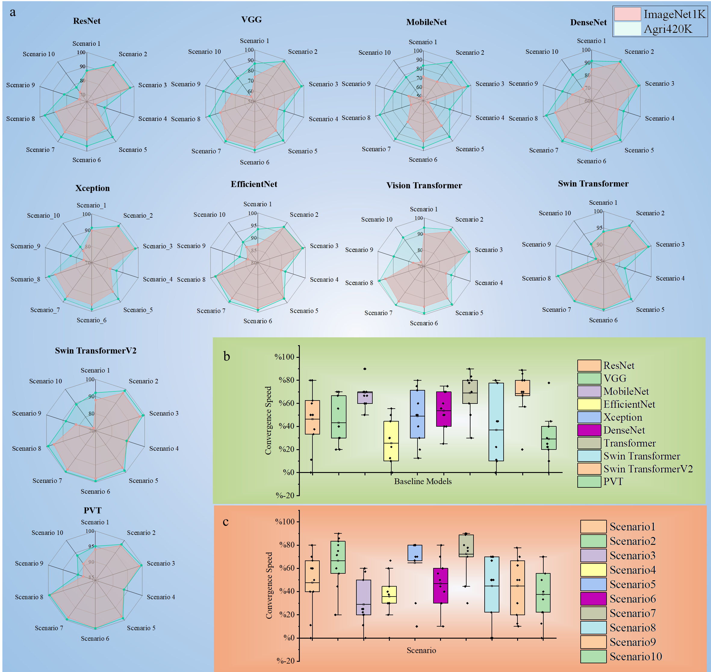

<div align="center">

<h1>Agri420K: A Large-Scale Benchmark Dataset for Agricultural Image Recognition</h1> 

<div>
    <a>Guorun Li</a>;
    <a>Yucong Wang</a>;
    <a>Liu Lei</a>;
    <a>Xiaoyu Li</a>;
    <a>Shuohua Zhang</a>;
    <a>Wang Liu</a>;
    <a>Yuefeng Du*</a>;
</div>

<h3><strong>submitted to International Journal of Computer Vision in 2025</strong></h3>

</div>

## 🏠 TODOs
* [x] Agri420K dataset (val).    [Download Link](https://drive.google.com/drive/folders/1-EuB92O74W9MO_590YGsfAwipZbS6kQ7?usp=sharing).
* [ ] 10 Agriculture Downstream Task Datasets.
* [ ] pretrained weights in Agri420K
* [ ] pretrained weights in ten downstream tasks
* [ ] Agri420K dataset (train)

**Notes**:
- The details of Agri420K please see our paper and [excel](agri420k.xlsx).
- Due to the investment of funds for the work, we will make the training data publicly available after the article has been accepted.


## 🏠 Abstract
A high-quality dataset is the foundation for building any performance-powerful model. We investigated 154 datasets related to agricultural image processing and found that all datasets focus on a single agricultural scenario, 71.4% of the datasets have a size of less than 10 thousand, and only 3 datasets have a size of more than 100 thousand. Models trained on these datasets do not generalize well to open agricultural scenarios. To address the above issues, we construct a large-scale benchmark dataset—Agri420K, specifically targeted at the agricultural image processing domain. Agri420K contains 430 thousand high-quality images across 123 agricultural categories, covering 10 agricultural scenarios: fruits, diseases and pests, animals, weeds, crops, vegetables, insects, crop seeds, agricultural machinery, and agricultural remote sensing. We identify the 10 most frequently applied models in the agricultural image processing domain and conduct controlled experiments on the Agri420K and 10 downstream agricultural datasets with training-from-scratch and transfer learning, respectively. The experimental results demonstrate that Agri420K significantly improves model performance in agricultural image recognition tasks compared to ImageNet1K, with an average increase of 49.10% in convergence speed. To the best of our knowledge, Agri420K is the largest open-source image dataset in the agricultural domain, encompassing the widest range of scenarios, holding significant practical value for promoting the advancements in computer vision technologies within the agricultural domain.

## 🏠 Overview






## 🎁 Train and Test
We have provided detailed instructions for model training and testing, and experimental details. 

### Install
- Clone this repo:

```bash
conda create -n dt python=3.10 -y
conda activate dt
git clone git@github.com:CAU-COE-VEICLab/Agriculture-Benchmark.git
cd Agriculture-Benchmark
```
- Install `CUDA>=10.2` with `cudnn>=7` following
  the [official installation instructions](https://docs.nvidia.com/cuda/cuda-installation-guide-linux/index.html)
- Install `PyTorch>=1.8.0` and `torchvision>=0.9.0` with `CUDA>=10.2`:

```bash
pip install torch==1.10.0+cu111 torchvision==0.11.0+cu111 torchaudio==0.10.0 -f https://download.pytorch.org/whl/torch_stable.html
pip install timm==0.4.12
pip install opencv-python==4.4.0.46 termcolor==1.1.0 yacs==0.1.8 pyyaml scipy
```


### Data preparation
We use standard ImageNet dataset, you can download it from http://image-net.org/. We provide the following two ways to
load data:

- For standard folder dataset, move validation images to labeled sub-folders. The file structure should look like:
  ```bash
  $ tree data
  ImageNet1K and Agri420K
  ├── train
  │   ├── class1
  │   │   ├── img1.jpeg
  │   │   ├── img2.jpeg
  │   │   └── ...
  │   ├── class2
  │   │   ├── img3.jpeg
  │   │   └── ...
  │   └── ...
  └── val
      ├── class1
      │   ├── img4.jpeg
      │   ├── img5.jpeg
      │   └── ...
      ├── class2
      │   ├── img6.jpeg
      │   └── ...
      └── ...
 
  ```

## 🏠 Supported models
* [x] swin transformer v1&v2
* [x] vision transformer
* [x] pvt 
* [x] convnext
* [x] resnet
* [x] vgg
* [x] mobilenet v2&v3
* [x] efficientnet
* [x] xception
* [x] densenet

### Evaluation

To evaluate a pre-trained `MobileNet` on Agri420K val, run:

```bash
python -m torch.distributed.launch --nproc_per_node <num-of-gpus-to-use>  main_agri420k.py --eval \
--cfg <config-file, e.g.,  configs/agri420k_benchmark/mobilenet/pretrain/mobilenetv2.yaml > --pretrained <checkpoint> --data-path <imagenet-path> 
```

## Training from scratch 

To train the `SwinTransformer-B` on Agri420K, run:

```bash
python -m torch.distributed.launch --nproc_per_node <num-of-gpus-to-use>  main.py \
--cfg <config-file, e.g.,  configs/agri420k_benchmark/swin/pretrain/swin_base_patch4_window7_224.yaml > --data-path <imagenet-path> [--batch-size <batch-size-per-gpu> --output <output-directory> --tag <job-tag>]
```

## Model Hub
TODOs
| Rank | Models           | Flops/G | Params/M | Top-1 ACC/% ImageNet1K | ImageNet1K Model | Top-1 ACC/% Agri420K | Agri420K Model |
|:----:|:----------------:|:-------:|:--------:|:----------------------:|:----------------:|:--------------------:|:--------------:|
|  1   | ResNet           |   7.9   |   44.5   |          81.7          |      [link]()    |          86.8        |     [link]()   |
|  2   | VGG              |  19.6   |  143.7   |          71.5          |      [link]()    |          81.5        |     [link]()   |
|  3   | MobileNet        |   0.3   |    3.5   |          72.0          |      [link]()    |          79.6        |     [link]()   |
|  4   | Xception         |   4.6   |   22.9   |          79.0          |      [link]()    |          91.0        |     [link]()   |
|  5   | EfficientNet     |  18.1   |  206.8   |          84.4          |      [link]()    |          90.4        |     [link]()   |
|  6   | DenseNet         |   4.4   |   20.0   |          77.5          |      [link]()    |          91.6        |     [link]()   |
|  7   | Vision Transformer|  12.7  |   88.2   |          77.9          |      [link]()    |          64.8        |     [link]()   |
|  8   | Swin Transformer |  15.2   |   87.7   |          83.5          |      [link]()    |          91.9        |     [link]()   |
|  9   | Swin Transformer V2| 15.0  |   67.0   |          83.9          |      [link]()    |          92.2        |     [link]()   |
| 10   | PVT              |  11.4   |   82.0   |          83.8          |      [link]()    |          92.2        |     [link]()   |


## Acknowledge

Our implementations are partially inspired by [Swin Transformer](https://github.com/microsoft/Swin-Transformer).

Thanks for their great works!

## Citation
